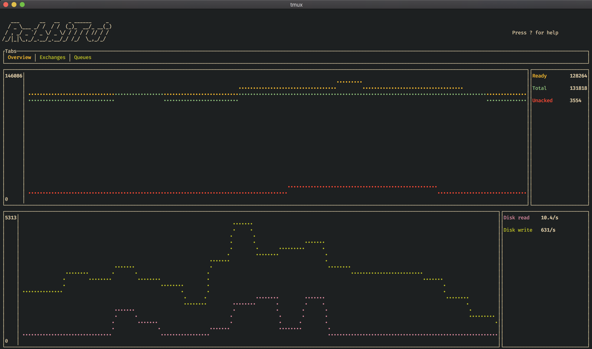

<p align="center">
  <h1 align="center">RabbiTui</h1>
  
</p>

`RabbiTui` is a terminal client for the [RabbitMQ Management API](https://www.rabbitmq.com/management.html).

## Installation

### Homebrew

```
brew tap maxmindlin/rabbitui
brew install rabbitui
```

### Building from source

`cargo build --release && ./target/release/rabbitui` builds in release mode and runs the resulting binary.

### Usage

There are a number of cli options for starting up the UI. For help use `rabbitui --help`.

By default, it connects to `http://localhost:15672` with the default credentials. You can change this via cli parameters.

At any time in the application you can press `?` to see a help menu for the panel you are in.
